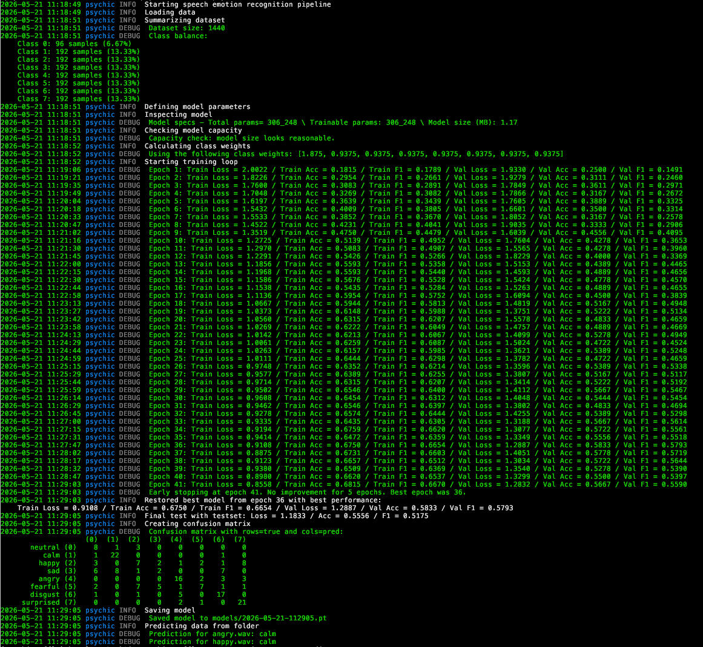

<h1 align="center">
  
  <br/>
  🔮 psychic-waffle 🧇
</h1>

**Speech Emotion Project** focused on building Speech Emotion Recognition (SER) models with the RAVDESS dataset.

`psychic-waffle` trains and evaluates a speech emotion recognition pipeline for classifying spoken audio into these 8 emotions:

- neutral
- calm
- happy
- sad
- angry
- fearful
- disgust
- surprised

The project ships with a **CLI tool with a training pipeline and optional model save/load helpers**. Additionally, there is also a small **human performance script** so you can compare model performance against human performance.

<div align="center">
  
</div>

Disclaimer: The purpose of this project was to learn more about **deep learning**, how to build and manage **machine learning projects**, how to work with **audio data** and to learn the basics of **pytorch**.

## 🚀 Quick Start

### Installation

1. Create an environment, e.g. with conda for a M-chip Mac with

```bash
CONDA_SUBDIR=osx-arm64 conda create -n psychicwaffle python=3.12.4 -c conda-forge
conda activate psychicwaffle
conda config --env --set subdir osx-arm64
```

2. Install the project with

```bash
pip install -e .
```

3. If you want to use the frozen/pinned package versions install them with

```bash
pip install -r requirements.txt
```

## &#x1F50A; Data

This project uses the Ravdess dataset. Load the zip file `Audio_Speech_Actors_01-24.zip` from the [Affective Data Sience Lab](https://zenodo.org/records/1188976?preview_file=Audio_Speech_Actors_01-24.zip), save it in the `data/` directory and unzip it there.

You should now have a folder in `data/` called `Ravdess_Audio_Speech_Actors_01-24` with other folders inside for each actor.

Expected structure:

```text
data/
└── Ravdess_Audio_Speech_Actors_01-24/
    ├── Actor_01/
    ├── Actor_02/
    ├── ...
    └── Actor_24/
```

## &#x1F3C2; Running The Project

Run the project with `psy` after installing.

```bash
psy --train [--save] [--predict]
psy --load --predict
```

The CLI supports training a fresh model, loading the latest saved model, saving a trained model, and running predictions on local audio files.

### CLI Arguments

#### `--train`

Train a new model with the training pipeline.


#### `--load`

Load the latest saved model from the `models/` folder.


#### `--save`

Save the trained model into the `models/` folder.

Important: `--save` only makes sense together with `--train`


#### `--predict`

Predict all supported audio files from the `to_predict/` folder.

```text
to_predict/
├── sample-1.wav
├── sample-2.wav
└── ...
```

Examples:

```bash
psy --train --predict
psy --load --predict
```

## &#x1F9D9; Human-Level Performance Test

The repository includes an interactive script at `scripts/human-level-performance-test` to estimate how well a human can identify emotions from the same RAVDESS speech samples.

### What It Does

- loads the RAVDESS audio dataset
- asks how many files you want to test
- plays random samples one by one
- lets you guess the displayed emotion
- reports final accuracy across the chosen samples

During the test:

- type the number of the emotion you think you heard
- type `replay` to hear the sample again

### Run It

```bash
python scripts/human-level-performance-test
```

### Optional Argument

#### `--feedback`

Show immediate feedback after each guess instead of waiting until the end.

Example:

```bash
python scripts/human-level-performance-test --feedback
```

### Notes

- the script currently uses `afplay` for playback, so it expects macOS audio playback support
- it requires the RAVDESS dataset to already be present in `data/`

## &#x1F9D1;&#x200D;&#x1F4BB; Development

If you want to install new dependencies, follow the instructions below:

1. Add the new package to `pyproject.toml`
2. Install it with `pip install -e .`
3. Freeze/pin versions in `requirements.txt` by running

```bash
pip-compile pyproject.toml --resolver=backtracking
```

